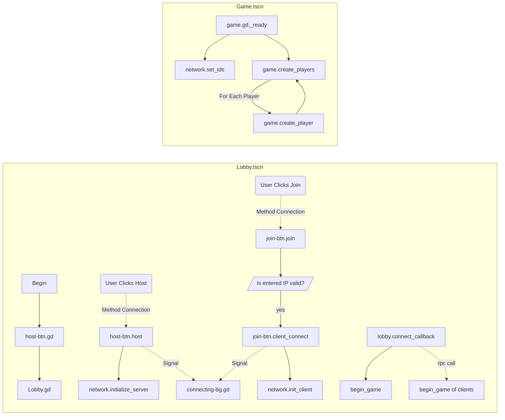

# Peer2Peer Networking Demo Project

Ryan Williams

Adopted from [this](https://youtu.be/MNCJTP8xXcI) tutorial on Youtube.

## Goal

Connect a host player to client player and synchronize actions in a simple game. 

## Basic Class (Scene) Diagram

## Lobby.tscn

## Game.tscn